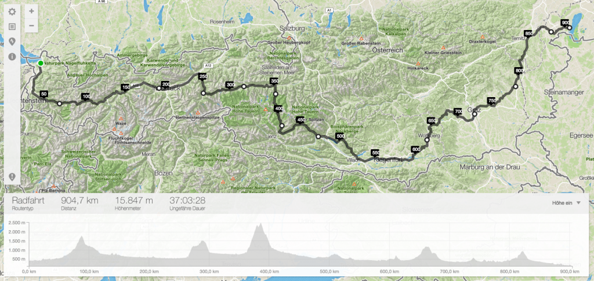

In einem meiner ersten Artikel am Blog erzählte ich euch von den [fünf Radrennen](https://wp.hochitom.at/fuenf-radrennen-bei-denen-ich-einmal-start-stehen-moechte/) bei denen ich einmal am Start stehen möchte. Nachdem mich einige Leute darauf angesprochen haben, habe ich beschlossen einen weiteren Artikel über Strecken bzw. Berge zu schreiben die ich einmal mit dem Rad bezwingen möchte.

<!--more-->

## Großglockner

https://www.youtube.com/watch?v=aidrR9_JPlg

Ganz oben auf dieser Liste steht bei mir der Großglockner. Den höchsten Berg Österreichs sollte jeder Österreicher zumindest einmal mit dem Rad bezwungen haben. Ob ich den Glockner dabei von der Salzburger- oder der Kärntner Seite bezwinge ist mir momentan egal. Ich denke, beide Anstiege haben es in sich und ob jetzt der eine, oder der andere Anstieg schöner ist, ist sicherlich Geschmacksache. Für Empfehlungen bin ich aber jederzeit offen.

## Alpe d'Huez

Auch wenn es Leute geben soll, die behaupten mindestens [einhundert schönere Anstiege als den hinauf nach Alpe d'Huez](http://www.cycling-challenge.com/100-cycling-climbs-better-than-alpe-dhuez/) zu kennen, steht dieser Anstieg bei mir an zweiter Stelle. Seit meiner Zeit als ich in jungen Jahren die Tour de France aufgeregt verfolgt habe, hat dieser Berg einen ganz besonderen Stellenwert für mich. Einmal einen Anstieg zu bezwingen, den auch schon Lance Armstrong, Marco Pantani oder auch Jan Ullrich hinauf "geflogen" sind. Das wär's und dafür nehme ich auch gerne einen Ausflug nach Frankreich in kauf.

## Stoneman-Dolomiti

https://www.youtube.com/watch?v=RBc_Q69CBZY

Nach zwei Bergen fürs Rennrad ist es nun Zeit für etwas gröberes. Was ist dafür besser gedacht, als eine Tour in den Dolomiten. Der [Stoneman-Dolomiti](http://www.stoneman.it/de/stoneman-dolomiti) ist eine 115 Kilometer lange Mountainbike-Tour, die wahlweise an einem, zwei oder drei Tagen abgefahren werden muss, will man eine Trophäe in gold, silber oder bronze erhalten. Dabei sind fünf Checkpoints zu erreichen und über 4000 Höhenmeter zu bewältigen. Als besonderes Highlight gilt dabei die so genannte "[Demut-Passage](https://www.youtube.com/results?search_query=demut-passage&page=&utm_source=opensearch)".

## Alpe Adria Trail

Auf den Alpe Adria Trail wurde ich bei einem Urlaub in Kärnten vor zwei Jahren aufmerksam. Auf 300 Kilometern und mehr als 5000 Höhenmetern durchquert man dabei Österreich, Slowenian und Italien, bis man das Ziel die Adria erreicht hat. Neben traumhaften Trails erlebt man beim Alpe Adria Trail auch Zeitgeschichte. Kommt man doch an Schauplätzen des ersten Weltkriegs vorbei und fährt dabei auf Wegen die im ersten Weltkrieg angelegt wurden.

## Bodensee-Neusiedlersee

Ich weiß zwar nicht ob es für diese Österreich-Durchquerung auch offizielle Touren gibt, aber von dem träume ich schon seit Jahren. Einfach einmal eine Woche Urlaub nehmen, mit dem Zug nach Bregenz fahren und dann Österreich von Westen nach Osten durchqueren. Über die genaue Strecke habe ich mir bis jetzt noch keine Gedanken gemacht, aber man könnte zum Beispiel die Route so anlegen, dass man gleich auch den ersten Punkt auf dieser Liste erledigt und den Großglockner überquert.

## Und ihr so?

Welche Touren möchtet ihr einmal in eurem Leben fahren? Was steht auf eurer To-Do Liste? Ich würde mich freuen auch von euren Plänen, Wünschen und Träumen zu erfahren :)