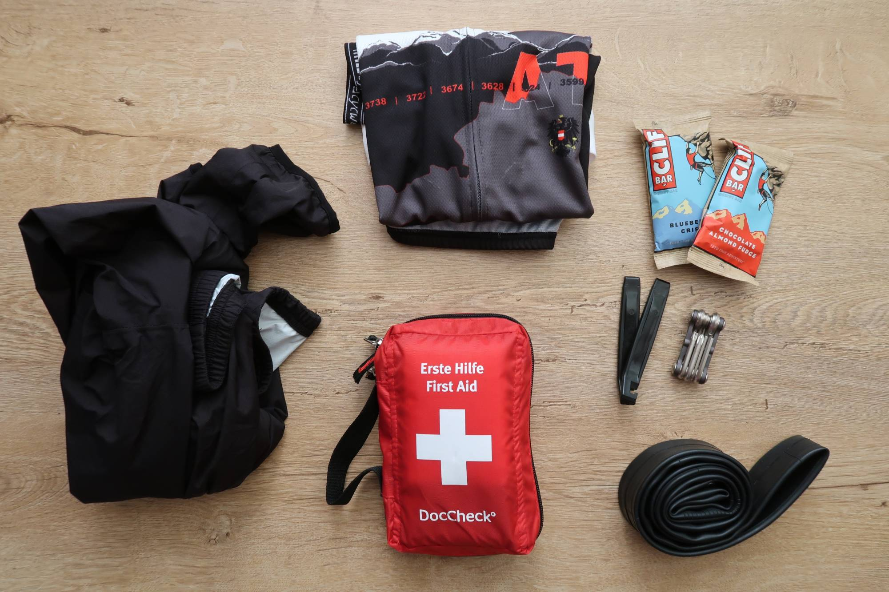
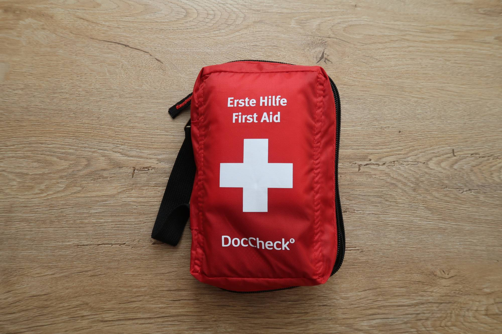
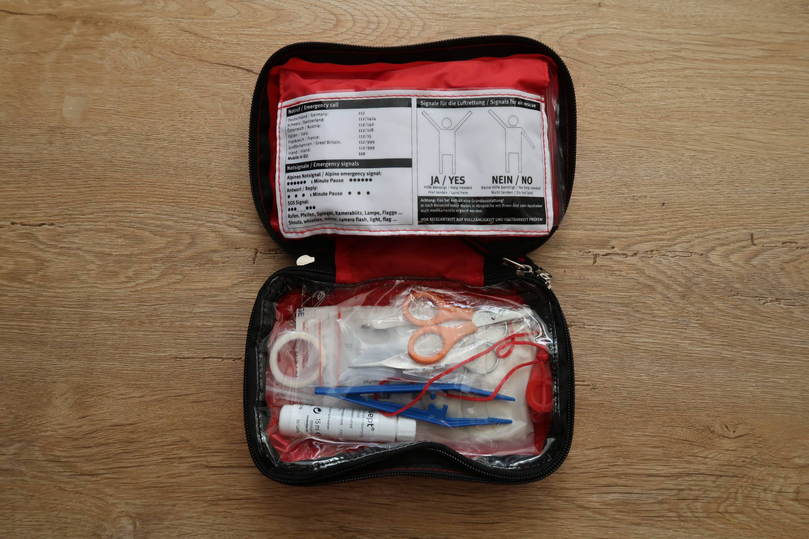
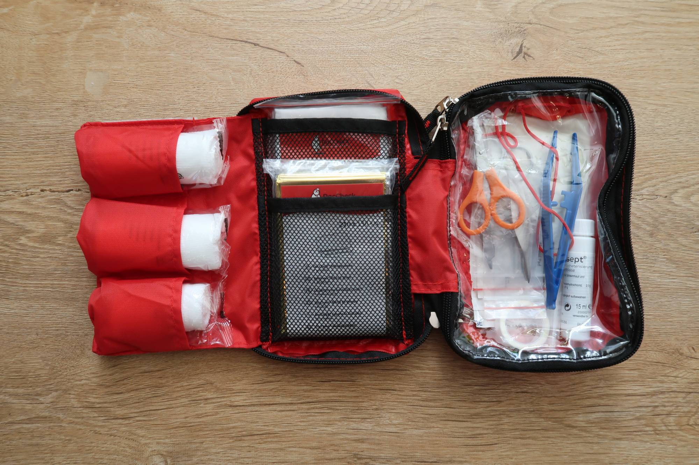
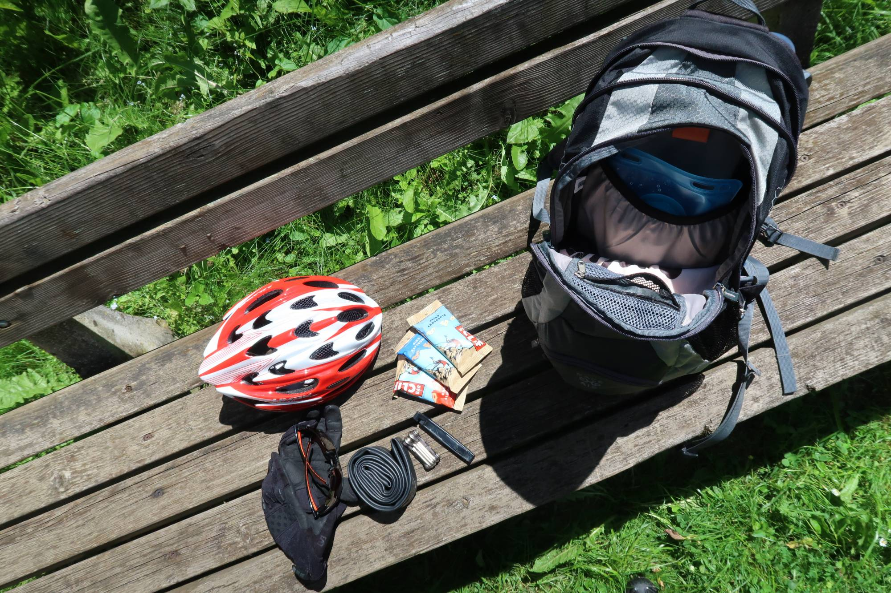

Das hier ist kein Modeblog! Ich persönlich interessiere mich auch nicht für Modeblogs und trotzdem schreibe ich gerade einen Artikel zu dem ich - ich geb's zu - von Modeblogs inspiriert wurde. Mir taugen [solche](https://ma.tt/2017/05/whats-in-my-bag-2017/) [Artikel](http://coralandmauve.at/whats-in-my-bag/), Videos und [Bilder](https://www.instagram.com/p/BRxpNiyDu_L/?taken-by=lisas_cheerfulsoul) nämlich total, die Geschichten von diversen Taschen oder Rucksäcken und ihren Besitzern erzählen. Als ich meinen Rucksack vor meiner letzten Mountainbike-Tour packte, kam mir die Idee dazu. Immerhin packen wir Radler unsere Rucksäcke doch recht unterschiedlich.

## Die Grundausstattung

Grundsätzlich unterscheidet sich der Inhalt bei mir je nach Jahrsezeit und Tour-Länge, während im Sommer nur die leichte Regenjacke platz findet wird die im Herbst schon einmal durch eine dicker Regenjacke ersetzt die auch wirklich trocken hält. Aber ein paar Dinge gibt es, die dann immer dabei sind:

1.  Erste-Hilfe Tascherl
2.  Ersatzschlauch
3.  Pumpe
4.  Werkzeug
5.  Riegel/Banane
6.  Wechselleiberl
7.  Regenjacke

Die ersten vier Dinge sind eindeutig die, wo man froh ist wenn man sie umsonst mit hat. Trotzdem sollten sie aber meiner Meinung bei keiner Tour fehlen. Manchmal ist es auch einfach nur gut fürs Karma, wenn man einem anderen Radler mit einem Schlauch oder einer Pumpe behilflich sein kann.

In der Erste-Hilfe-Tasche befindet sich fast alles, was ich als ehemaliger Rettungssanitäter brauchen kann. Neben Pflastern, Verbänden und Wundauflagen, sind außerdem eine Rettungsdecke, eine Verbandsschere, Pinzetten, Einweg-Handschuhe und sogar eine Rettungspfeife dabei. Außerdem ganz hilfreich: die Erklärung der unterschiedlichen Notsignale und Signale für die Flugrettung.

Die Dinge in der zweiten Hälfte der Liste sind bei mir vor allem bei Touren ab zwei Stunden Fahrzeit mit dabei. Dabei ist das zweite Trikot zum Heim fahren oder für die Pause bei der Hütte, für mich einabsolutes Muss. Immerhin musste ich das früher bei Mama schon immer dabei haben ?

## Die Add-Ons

Manchmal wird der Rucksack dann auch noch mit diesen Dingen befüllt:

1.  Stativ
2.  Kamera
3.  Haube
4.  Arm-/Beinlinge

Die Kamera und das Stativ sind natürlich bei Runden dabei, wo ich weiß oder zumindest hoffe, dass es etwas fotografierenswertes gibt und die Handykamera zu wenig ist, bzw. ich alleine unterwegs bin und [Fotos für Instagram](https://www.instagram.com/p/BLYBuLKBuQE/) brauche. Punkt neun und zehn findet ihr vor allem bei kühleren Ausfahrten in meinem Rucksack. Schön klein zusammen gerollt nehmen weder die Haube noch Arm- und Beinlinge kaum Platz weg.

Der ein oder andere wird auf meiner Liste eine Trinkblase vergeblich suchen. Ich habe zwar eine, jedoch konnte ich mich noch nicht so recht damit anfreunden. Vor allem die Reinigung und Pflege der Trinkblase nach der Tour ist mir einfach zu mühsam und so begleitet mich diese nur äußerst selten. Da greife ich lieber zur Trinkflasche und fülle mir die bei einem Brunnen oder einer Almhütte auf.

Mir persönlich fehlt noch ein kleiner Gucker auf meiner Liste. Weil ich es einfach total romantisch finde, wenn du am Berg oben stehst und dann mit dem Gucker die umliegenden Gipfel beobachtest. Und was hab ihr so mit wenn ihr Rad fahren geht?

