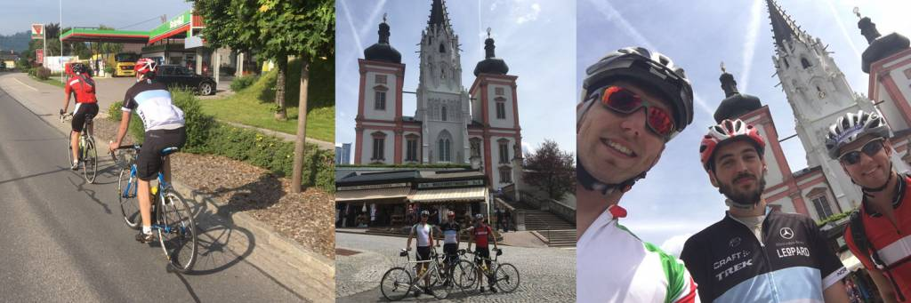

Wer den Artikel mit meiner Strava-Statistik 2016 gelesen hat, wird schon wissen wovon ich jetzt schreibe. Für diejenigen die den Jahresrückblick nicht gelesen haben, lüfte ich das Geheimnis sofort: dieser Artikel handelt von meiner bisher längsten Radtour die ich jemals absolviert habe.

<!--more-->

Es war um den 20. Mai als mich ein Freund darauf ansprach, ob ich nicht in der darauf folgenden Woche mit dem Rad mit ihm und einem weiteren Freund nach Mariazell fahren möchte. Zuerst zweifelte ich, ob ich die Einladung annehmen sollte, bin ich doch bis dahin noch nie eine ähnliche Distanz gefahren. Ich bin auch noch nie mehr als 100 Kilometer am Rad gesessen. Das war schon eine ziemliche Überwindung. Schlussendlich habe ich mich aber dazu entschlossen mitzufahren und so starteten wir am 27. Mai um Punkt 8 Uhr in Kindberg.

Von Kindberg ging es über den Pogusch und den Seeberg nach Mariazell. Die beiden Anstiege auf den Pogusch und den Seeberg absolvierten wir in einem recht gemütlichen und lockeren Tempo. Am Seeberg nutzten wir eine Pause für ein paar Selfies und warfen uns einen Riegel ein. Danach ging es für ca. 25 Kilometer neben dem Aschbach nach Gußwerk und weiter nach Mariazell, wo wir nach etwas mehr als drei Stunden Fahrzeit und 56 Kilometern unser erstes Etappenziel erreichten. In Mariazell absolvierten wir zunächst ein Mini-Touristen Programm (Basilika anschauen und Lebkuchen kosten), ehe wir uns vor der Basilika mit einer Portion Nudeln stärkten.

Nach Hause fuhren wir zuerst noch, wie wir gekommen waren: über Gußwerk ging es Richtung Seeberg ehe wir dann bei Wegscheid Richtung Niederalpl abbogen. Gestärkt mit der Pasta schlugen wir ein etwas höheres Tempo beim Anstieg aufs Niederalpl an. Angeheizt durch die Nachmittagssonne, die gnadenlos in den Nacken brannte, floss der Schweiß in Strömen.  Nach diesem gut 6 Kilometer langen Anstieg hinauf auf die Passhöhe erwarteten uns danach nurmehr die letzten 50 Kilometer Heimfahrt, auf denen es eigentlich nurmehr bergab ging. Diese letzten 50 Kilometer sind aber die, welche mir am ärgsten in Erinnerung geblieben sind. Offenbar schlugen wir beim letzten Anstieg doch ein zu hohes Tempo ein.

Wir radelten recht flott von Neuberg über Mürzsteg und Mürzzuschlag nach Kindberg und wechselten uns auch immer ab, wenn es darum ging vorne Tempo zu machen. Hinten verdrückte ich meine letzten beiden Riegel, welche ich eigentlich nur mit hatte weil ich noch Platz in einer meiner Trikottaschen hatte. Hätte ich aber noch drei oder vier Riegel mehr mitgehabt, ich hätte sie auch noch gegessen weil ich so hungrig war ?

Nach über fünf Stunden reiner Fahrzeit, fast 130 Kilometern und nicht ganz 1.800 Höhenmetern erreichten wir, glücklich aber geschlaucht unseren Ausgangspunkt wieder.

[strava activity="589717130"]