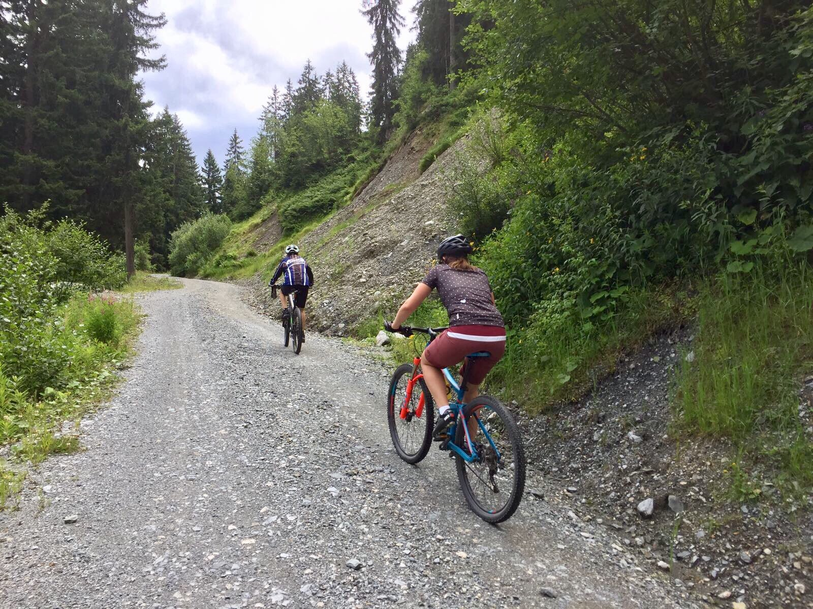

Das vergangene Wochenende verbrachte ich gemeinsam mit Freundin und Eltern in Saalbach. Saalbach ist für uns schon so etwas wie eine zweite Heimat geworden, denn mindestens einmal im Jahr verbringe ich ein paar Tage dort. Neben dem jährlichen Schiurlaub ging es für diesmal endlich wieder zum Mountainbiken ins Pinzgau. Nachdem mein letzter Mountainbike-Urlaub im Glemmtal bereits wieder fünf Jahre her war, kam es mir sehr gelegen als mich meine Eltern fragten ob meine Freundin und ich nicht mitkommen wollen.

## Ein nasser Start

Pünktlich als ich daheim die Räder ins Auto verfrachtete, begann es zu regnen. Der Regen begleitete uns dann auch noch bis Samstag Nachmittag, weshalb wir unsere Zeit zuerst nicht mit Mountainbiken verbrachten, sondern uns lieber [Burger in Zell am See](https://cheerfulsoul.blog/the-burger-factory/) gönnten. Am Nachmittag hörte der Regen dann endlich auf und wir unternahmen zumindest [eine kleine Runde](https://www.strava.com/activities/1084787051) Richtung Talschluss.​

[video src="img_2006.mp4" poster=""][/video]

## ​Endlich trocken

Am Sonntag war das Wetter dann endlich so wie man es sich vorstellt, oder so. Zumindest war es trocken, denn erst als wir am Abend wieder vorm Hotel saßen, erreichte das Thermometer die 20 Grad Marke. Nach den heißen vergangenen Tagen waren diese Temperaturen eine wahre Wohltat. Dick eingepackt ging es nach dem Frühstück von unserem Hotel zuerst den Radweg entlang der Saalach nach Saalbach und dann weiter zum [Spielberghaus](http://www.spielberghaus.at/de/) wo wir die erste Pause einlegten und die ersten Sonnenstrahlen genießen konnten.

Nach einer frischen Buttermilch ging es weiter Richtung Reiterkogel. Dafür mussten wir zuerst wieder ein paar Meter hinunter fahren. Ich nahm dafür den [Höllentrail](https://www.saalbach.com/de/tour/H%C3%B6llen%20Trail%20an%20der%20Kohlmaisgipfelbahn%20in%20Saalbach%20Hinterglemm_9801710), der direkt beim Spielberhaus startet und einem nach rund einer Minute Fahrzeit wieder ausspuckt. Dafür muss man aber ein paar Höhenmeter mehr zum Reiterkogel in Kauf nehmen. Was angesichts des Spaßfaktors der Trails durchaus in Kauf genommen werden sollte!

Die Auffahrt zum Reiterkogel beginnt recht entspannt. Vom Spielberhaus kommt man zuerst an der Bergstation der Bärnkogel-Bahn vorbei, ehe man nach viereinhalb Kilometern und rund 400 Höhenmetern den Wetterkreuz Speichersee erreicht. Das Baden dort ist zwar nicht erlaubt, trotzdem laden einige Bänke und Tische für eine kurze Pause ein.

Die letzten eineinhalb Kilometer bis zum Gipfel gilt es sich dann noch einmal hart zu erkämpfen. Immer wieder stellen sich einem Rampen mit bis zu 20% Steigung in den Weg. Am Gipfel angekommen wird man dann aber mit einem traumhaften Panorama belohnt. Zwar versteckten sich die Hohen Tauern mit dem Großglockner in einer dicken Wolkenschicht, doch auch die umliegenden Berge des Glemmtals auf der einen, und das steinerne Meer auf der anderen Seite, entschädigten uns für die Strapazen.

<iframe style="border: 0;" src="embed?pb=!1m0!4v1500290688398!6m8!1m7!1sF%3A-KhPiA_bni5I%2FWWxGuC3WO3I%2FAAAAAAAABbg%2Fs64VbUwUWo0dxcNjI_bzxdvnzZ1mGPzUwCLIBGAYYCw!2m2!1d47.40123699999999!2d12.5934654!3f189.44275433889524!4f-14.853515009593877!5f0.4000000000000002" width="600" height="450" frameborder="0" allowfullscreen="allowfullscreen"></iframe>

## Von nun an ging es bergab

Danach ging es für uns nurmehr bergab. Zuerst zur [Rosswaldhütte](http://www.rosswaldhuette.at/de/), wo wir die nächste Pause einlegten und uns für die Heimfahrt stärkten. Dann ging es weiter zur Reiterkogelbahn. Hier trennten sich unsere Wege wieder. Ich ließ es mir nämlich nicht nehmen, die Abfahrt über die [Blue Line](https://www.bike-n-soul.at/de/bike-touren/blue-line/) zu nehmen. Der zweieinhalb Kilometer lange Trail ist einer der ältesten Trails in Saalbach. Schon bei meinem ersten Besuch vor mehr als zehn Jahren, wagte ich mich das erste Mal hinunter. Auch dieses Mal spuckte mich der Trail nach knapp sieben Minuten mit einem dicken Grinser bei der Talstation der Reiterkogelbahn aus.

<map id="iaabxnmlvdooqmaz"></map>
