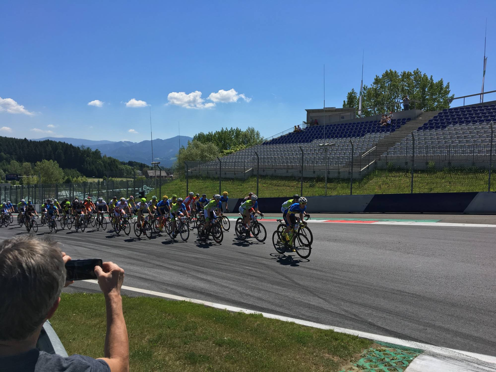
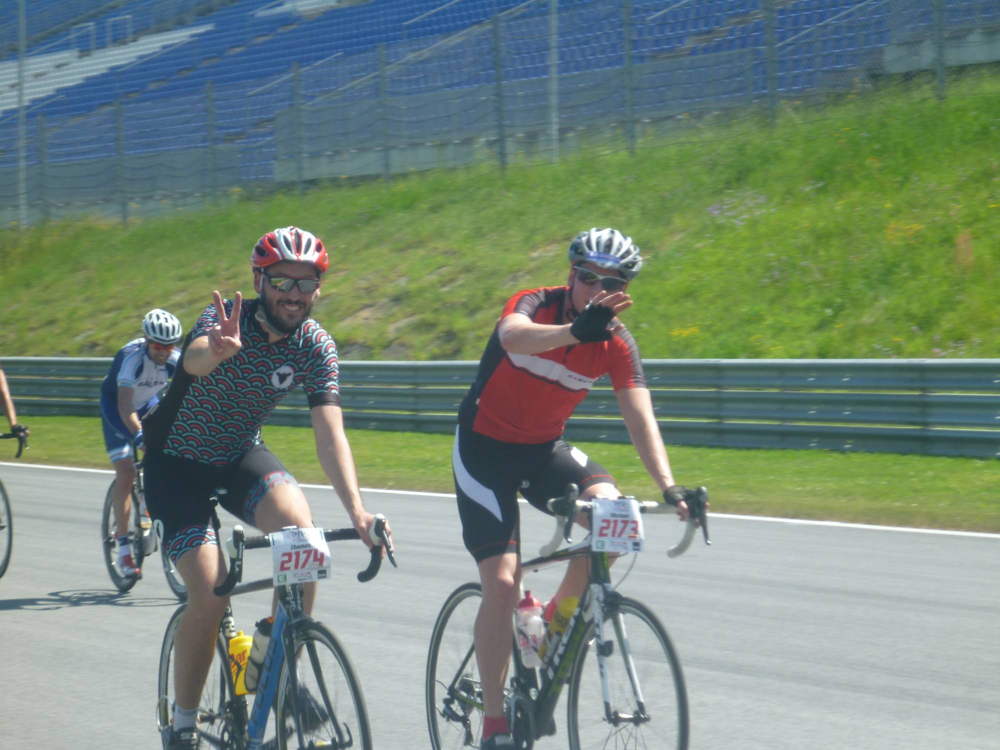
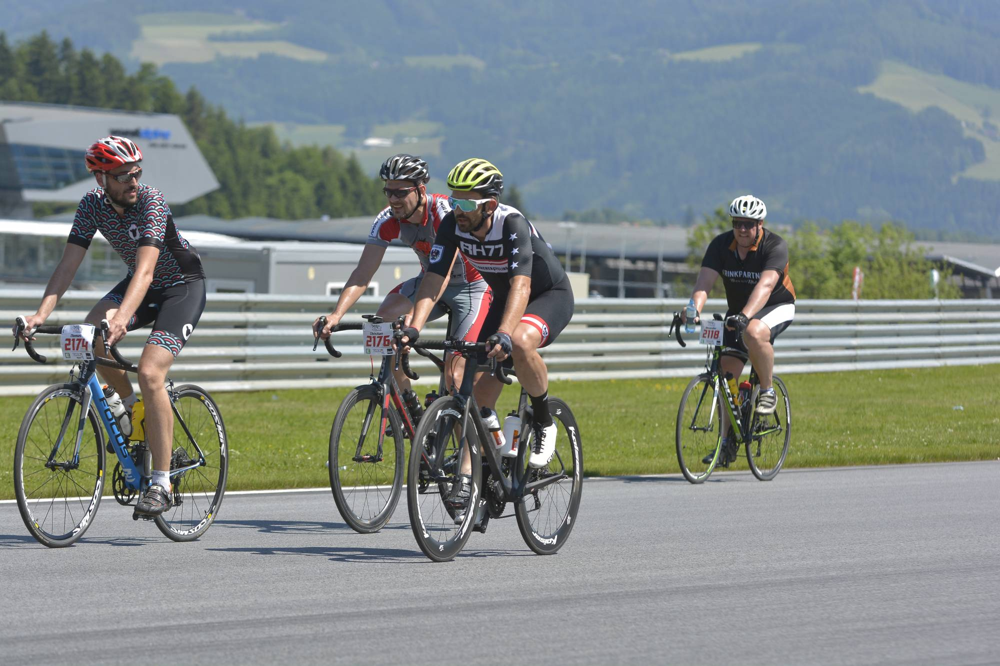

Eine Minute, sechs Sekunden und Zweihundertachtundzwanzig Hundertstel Sekunden (1:06,228 min., laut [Wikipedia](https://de.wikipedia.org/wiki/Red_Bull_Ring)). Das ist die derzeit offizielle schnellste Runde am Red Bull Ring in Spielberg, gefahren von Lewis Hamilton 2016 in seinem Mercedes Formel1 Wagen. Am vergangenen Sonntag konnte ich im Rahmen der Ring Attacke auch erstmals ein paar Runden am Ring drehen und brauchte dabei fast sieben Mal so lange wie Lewis Hamilton, nämlich sieben Minuten und vierundzwanzig Sekunden (7:24 Minuten, laut [Strava](https://www.strava.com/activities/1010292115)). Mit dem Fahrrad wohlgemerkt 🙈

<!--more-->

Am Sonntag dem 28. Mai 2017 lud Armin Assinger zum mittlerweile dritten Mal zur [Ring Attacke](http://ringattacke.com/) nach Spielberg. Bei drei Bewerben über eine, zehn oder 25 Runden standen unter hunderten Teilnehmern auch bekannte Persönlichkeiten wie [René Haselbacher](https://de.wikipedia.org/wiki/Ren%C3%A9_Haselbacher), [Peter Wrolich](https://de.wikipedia.org/wiki/Peter_Wrolich), [Lisa Hütthaler](https://de.wikipedia.org/wiki/Lisa_H%C3%BCtthaler), [Nicole Schmidhofer](https://de.wikipedia.org/wiki/Nicole_Schmidhofer) und eben Schirmherr [Armin Assinger](https://de.wikipedia.org/wiki/Armin_Assinger) am Start. Dabei galt es die originale Formel1 Rennstrecke zu je 4,3 Kilometern und 56 Höhenmetern maximal 25 mal zu bewältigen. Maximal deswegen, weil der Rennmodus wie eben bei der Formel1 war, und das Rennen aus war sobald der erste Fahrer die 25 Runden absolviert hatte. Danach fuhr noch jeder Teilnehmer seine begonnene Runde fertig und dann war es geschafft. So viel zur Theorie.

Schon als mir meine Freundin im März die Ausschreibung zur Ring Attacke per E-Mail schickte wusste ich, dass ich dort am Start stehen werde. Denn schon in den vergangenen Jahren reizte es mich, einmal mit dem Fahrrad auf der Rennstrecke in Spielberg zu fahren. Leider konnte ich bis dahin keine passende Veranstaltung finden.

Am Sonntag kurz nach zehn Uhr, nachdem ich und mein Begleiter unsere beiden Rennräder im Auto verstaut hatten, machten wir uns auf den Weg nach Spielberg. Am Ring angekommen, besorgten wir sofort unsere Startnummern, sowie das obligatorische Goodie-Bag und dann schauten wir uns auch noch den Start der Ring Attacke zehn an und begutachteten zu Fuß den ersten Anstieg gleich nach der Start/Ziel-Geraden.

Danach ging es für uns zurück zum Auto, wo wir zuerst unsere Räder und dann uns selbst rennfertig machten. Als wir zurück in die Boxengasse kamen, war bereits die Siegerehrung der ersten beiden Bewerbe und gleich darauffolgend rollten wir zum ersten mal mit unseren Rennrädern über die Ziellinie des Red Bull Rings. Dann radelten wir zum Einfahren locker den ersten Anstieg hinauf zur ersten Kurve um dann gleich Richtung voestalpine- und Ziel-Kurve abzukürzen.

Um 13:45 war es dann soweit und der Startschuss schallte über den Ring. Die erste Runde wurde noch neutralisiert gefahren, wobei neutralisiert eher für die Spitzenfahrer galt. Immerhin absolvierte ich in dieser Runde auch gleich meine schnellste Runde, die ich in den folgenden Runden nichtmehr erreichen sollte. Und das auch deutlich. Mit einem Durchschnittspuls von 182 war diese Runde aber auch voll auf Anschlag und dieses Tempo hätte ich nicht einmal zehn Runden durchgehalten.

In den nächsten Runden verteilte sich das Teilnehmerfeld über die gesamte Strecke und so konnte ich ein für mich recht gutes Tempo finden. Die ersten acht Runden absolvierte ich ohne Probleme, dann nach einer Stunde meldete sich als erster mein Hintern zu Wort. Was mich heute noch in Staunen versetzt, denn normalerweise sitze ich drei Stunden auch im Sattel ohne Sitzbeschwerden. Daran gewöhnte ich mich aber nach ein paar Runden und nutzte dann vor allem die Abfahrten um mein Hinterteil zu entlasten.

[video width="1012" height="548" mp4="https://wp.hochitom.at/wp-content/uploads/ringattacke-2017-flybys.mp4" loop="true" autoplay="true"][/video]

Die Abfahrten sind aber mitunter das Highlight bei der Ring Attacke. Wenn man nicht gerade mitten in einer Gruppe fährt und dem Vordermann nicht zu nahe kommen will, sind die Bremsen am Rad eigentlich nur Dekoration. Immerhin sind diese Kurven für ganz andere Geschwindigkeiten ausgelegt und auch der Asphalt weißt keinerlei Schäden, geschweige denn Steine oder andere Verschmutzungen auf. Und so kann man die Kurven mit Vollgas durchfahren, was auch schon zum nächsten Problem führt. Vor allem in den ersten Runden drückte ich beim bergab fahren so aufs Tempo, dass ich keine Zeit zum erholen hatte. Das hat sich dann aber mit der Erfahrung gelegt, denn Körner haben eh die zwei Flachstücke zwischen den Kurven und die beiden Anstiege nach dem Start genug gekostet.

Irgendwann in Runde dreizehn, oder vierzehn meldete sich dann mein Magen zu Wort. Anscheinend hatte er das Gefühl, dass ich ihm in den letzten zwei Stunden zu wenig Zuneigung zeigte und meldete sich spürbar zu Wort. Also griff ich bei der ersten greifbaren Banane in der Verpflegungszone zu und versuchte im Fahren, die halb geschälte Banane von den letzen Schalen zu befreien. Und wie ich so dahin fuhr und mit dem Schälen der Banane beschäftigt war übersah ich doch glatt einen Fahrer vor mir der gerade mit einem Defekt zu kämpfen hatte. Quasi in letzter Sekunde konnte ich den Lenker noch herum reißen und mich, meine Banane und vor allem den zweiten Radler vor einem Unfall bewahren. Aber wenigstens konnte ich meinen Magen mit der halben Banane beruhigen.

Nach über zwei Stunden Fahrzeit in der prallen Sonne und 30 Grad und mehr, war die Verpflegungszone nach der Startkurve eine willkommene Abwechslung. Dort griff ich mir in jeder zweiten Runde eine Flasche Wasser und schüttete es in und auf mich. Der Kopf und die Oberschenkel freuten sich jedes Mal über die willkommene kurze Abkühlung, ehe sie wieder die bis zu 12% steile Rampe zur Remus-Kurve hinauf treten mussten. Hier war erstmals auch für mich [#hitzesudern](https://twitter.com/search?q=%23hitzesudern&src=tyah) angesagt.

Nach 18 Runden bzw. zwei Stunden und 43 Minuten überquerte ich gemeinsam mit den gerade Führenden die Ziellinie und unsere letzte Runde wurde eingeläutet. Dann galt es noch einmal die allerletzten Reserven heraus zu kitzeln und ein klein wenig auch die letzte Runde zu genießen. Am Ende hatte ich 19 Runden und 81 Kilometer am Tacho stehen. Womit ich vollauf zufrieden war, denn wirklich ein Ziel wollte ich mir davor nicht setzen. Zu wenig kannte ich die Strecke und auch die anderen Teilnehmer. Für mich persönlich setzte ich mir das Ziel zwischen 15 und 20 Runden zu schaffen, wobei ich 20 eigentlich schon sehr ambitioniert fand. Im Nachhinein komme ich drauf, dass die zwanzig Runden durchaus schaffbar gewesen wären. Das wird dann wohl mein Ziel fürs nächste Mal.

Eines war mir nämlich schon kurz nach dem Rennen bewusst: dass ich nämlich nicht das letzte Mal mit dem Fahrrad den Red Bull Ring unsicher gemacht habe. Ich hoffe auch, dass ich den Ring im Rahmen der Ring Attacke wieder bezwingen werde, ist es doch eine perfekt organisierte Veranstaltung gewesen. Vor allem ist es eine seltene Chance eine Formel1 Strecke mit dem Fahrrad befahren zu können und noch dazu nicht alleine. Auch die Besucher am Streckenrand waren phantastisch, haben sie doch alle Fahrer unermüdlich angefeuert. Eine weitere Besonderheit ist das Format des Runden fahrens, wodurch man immer wieder die Möglichkeit bekommt sich in den Windschatten eines ehemaligen Rad-Profis zu hängen oder dies zumindest versuchen kann. Denn es ist echt beeindruckend in was für einem Tempo die Spitzenfahrer die Steigungen am Ring bewältigen.

Mehr Bilder gibt's unter anderem [hier](http://ringattacke.com/?page_id=15539), [hier](https://www.facebook.com/pg/kathrinsphotography/photos/?tab=album&album_id=1464203910284640) und [hier](http://www.maxfunsports.com/album/2017/ring-attacke).

[strava activity="1010292115"]