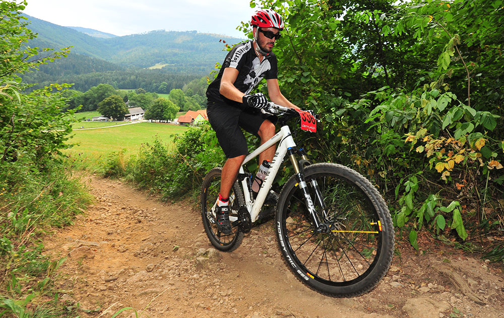
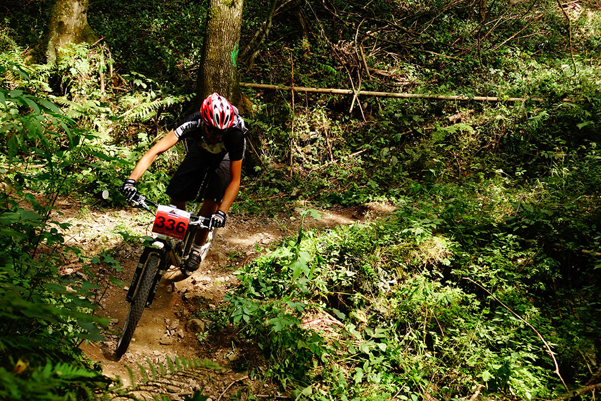

Nach fast zehnjähriger Rennabstinenz, bestritt ich vergangenes Wochenende wieder ein Mountainbike Rennen. Nachdem ich im Juli genügend Zeit hatte um zu trainieren, entschied ich mich recht spontan dazu an einem Mountainbike Marathon teilzunehmen. Der zeitlich und geographisch am besten gelegene Marathon, war der in Stattegg. Auch die Strecke von 66km und ungefähr 2.500 Höhenmetern schien mir passend, für die Anzahl an Trainings. Außerdem kam noch hinzu, dass ich die zwei Wochen vor dem Marathon nichtmehr trainieren konnte. Also musste die Form bereits Ende Juli stimmen.

<!--more-->

#### Sonntag, 16. August 2015, 7 Uhr

Das Auto wurde bereits am Vortag eingeräumt, also ging es gleich nach dem Frühstück los Richtung Graz. Dort angekommen, machte ich mich mit meinen Begleiterinnen (Danke Lisa und Kathi), gleich auf die Suche nach der Startnummernausgabe. Mit der Startnummer und einigen Goodies ging es dann gleich wieder zurück zum Auto, von wo wir uns den Start des Langstreckenbewerbs anschauten. Dieser war teil der Masters-EM und des Austrian Marathon Cups, die Elite also.

Nachdem das Feld nach wenigen Sekunden aus unserem Blickfeld verschwunden war, ging es auch für mich an die Rennvorbereitungen. Zuerst wurde das Rad ausgepackt und zusammen gebaut. Dann warf ich mich in Rennschale und begann mit dem Einfahren. Dabei inspizierte ich gleich die ersten Kilometer der Strecke, sowie den ersten Anstieg, der es echt in sich haben sollte.

#### 9.55 Uhr

Gut eingefahren ging es zum Start. Ich stellte mich ans Ende des Feldes um nicht ins Startgetümmel zu kommen und in meinem eigenen Tempo starten zu können. Noch schnell ein Foto vom Start auf Instagram posten und dann wurde es ernst.

https://www.instagram.com/p/6b8uEWIOi_/

#### 10 Uhr

Es geht los. 66km, 2.500 hm und ca. 5 Stunden am Rad stehen mir noch bevor.

Ich fand recht schnell mein Tempo, überholte nach dem Start einige Fahrer und fand dann eine Gruppe, die ebenfalls in meinem Tempo Richtung erstem Anstieg auf die Leber rollten. An deren Hinterrad hängte ich mich bis zum Anstieg.

Wie ich es beim Einrollen bereits feststellte, hatte es der erste Anstieg echt in sich. Mit einer Steigung von bis zu 28% waren erstmals gute Oberschenkel gefragt. Im darauffolgenden Waldweg fuhr ich gemeinsam mit zwei anderen Bikern, überholte diese jedoch in der ersten Abfahrt und war von da an, lange Zeit alleine unterwegs.

Nach ungefähr 15 Kilometern tauchten endlich wieder andere Teilnehmer in meinem Blickfeld auf. Ich war also tatsächlich noch auf der richtigen Strecke unterwegs. Zwischenzeitlich hab ich das nämlich schon bezweifelt. Auf den nächsten Kilometern holte ich also sukzessive den Rückstand auf meinen Vordermann auf, bis ich nach 22 Kilometern die Lücke schließen konnte. Den darauffolgenden Waldweg fuhren wir gemeinsam bis wir auf die Forststraße zurück Richtung Leber kamen. Dort zündete er plötzlich den Turbo und lies mich derartig stehen, dass ich nurmehr staunen konnte.

Also war ich nun wieder alleine unterwegs. Den darauffolgenden Bürgermeister Downhill überstand ich nur ganz knapp ohne Sturz. Durch die vielen Spuren rutschte mir kurz das Vorderrad weg, was ich aber rechtzeitig korrigieren konnte.

https://www.youtube.com/watch?v=w-gkGbZQlqs

Nach 28 Kilometern und zwei Stunden Fahrzeit kam ich zur zweiten Labestation. Ganz entspannt füllte ich mir meine Trinkflasche auf und fuhr ohne etwas zu Essen in den 17 Kilometer langen Anstieg auf den Schöckl. Was ich zu diesem Zeitpunkt noch nicht wusste. Denn auf dem ausgedruckten Höhenprofil, war das nämlich etwas anders zu entnehmen.

Dieser Anstieg raubte mir alle Kräfte und kostete mich fast zwei Stunden. Zum Schluss hin musste ich mit meinem Getränk schon haushalten, weil ich weder wusste wie weit es noch bis zum Gipfel, noch bis zur nächsten Labestation ist. Hier hätte sich eine vorherige Streckenbefahrung bezahlt gemacht. Denn dann hätte ich gewusst, wie ich mir die Kraft hätte einteilen müssen. Zum Schluss des Anstiegs war ich bereits so entkräftet, dass ich auf dem relativ flachen Asphaltstück bis zum Schöckl Nordlift mein Rad nurmehr schieben konnte.

Oben am Gipfel und an der letzten Labestation, rief mir ein Streckenposten die erlösenden Worte zu: ""Du hast es geschafft! Der höchste Punkt ist erreicht, von nun an geht's nurmehr bergab!" Mit dieser Botschaft in den Ohren stärkte ich mich kurz, trank einige Becher Cola und warf mich dann in den Downhill den Schöckl hinunter.

Normalerweise fahre ich sehr gerne und sehr schnell bergab. Diesmal aber war ich noch derart entkräftet, dass ich in den flacheren Teilstücken nichteinmal treten wollte. Außerdem lies mich jede Erschütterung fluchen, denn meine Arme schmerzten schon höllisch.

Nach 52 Kilometern stand die letzte Quälerei am Programm. Ich selbst konnte meinen Augen fast nicht trauen. Plötzlich stand ich vor einem Waldweg, der quasi senkrecht und kerzengerade in den Wald hinauf ging. "Das kann ja nicht ihr Ernst sein", dachte ich mir. Aber es half nichts. Da musste ich durch. Nach zehn Minuten schieben, für keine 500 Meter war auch die letzte Hürde geschafft und es wartete quasi nurmehr der Falschgraben.

Und der hatte es auch nochmal so richtig in sich. Nach fünf Stunden am Rad und ohne Kraft wartete zum Schluss noch ein drei Kilometer langer, staubiger, mit Wurzeln und Steinen gespickter Waldweg/Trail. Der mir normalerweise einen fetten Grinser ins Gesicht zaubert. Aufgrund der vorangegangen Tortur mich eher nervte.

#### 15:12 Uhr

Danach war es aber wirklich vorbei. Nach fünf Stunden und zwölf Minuten erreichte ich mit einem breiten Grinser das Ziel, noch dazu ohne Sturz und Defekt. Insgeheim hatte ich zwar mit einer Zeit unter fünf Stunden spekuliert, was auch bis zur Hälfte des Rennens locker möglich gewesen wäre. Durch meinen Einbruch am Schock, war mir das dann aber herzlich egal und ich freute mich, meinen ersten Marathon am Mountainbike absolviert zu haben.

Während des Rennens und kurz danach schwor ich mir zwar, nicht noch einmal bei einem Marathon antreten zu wollen. Mittlerweile aber hat sich das schon wieder geändert und ich bin schon wieder auf der Suche nach einem Event im kommenden Jahr.

###### [Meine Zeiten](http://www.event-timing.de/2015/0816stattegg/live/index.php?detail=336&category=24)

*   INT 1 - Leber (km 3.9) - 22:11,6
*   INT 2 - Leber (km 29.5) - 2:04:48,1
*   INT 3 - Schöckl (km 47.0) - 3:49:57,3
*   Finish (km 66.4) - 5:12:47,9
Alle Bilder © [www.sportograf.de](http://www.sportograf.com/de/shop/event/2875-14-Grazer-Bike-Marathon-Stattegg-2015#event)

Mehr Bilder gibt's auf [bikeboard.at](http://bikeboard.at/Board/Bildbericht-Grazer-Bike-Marathon-Stattegg-th214508)

<map type="strava" id="370407783"></map>