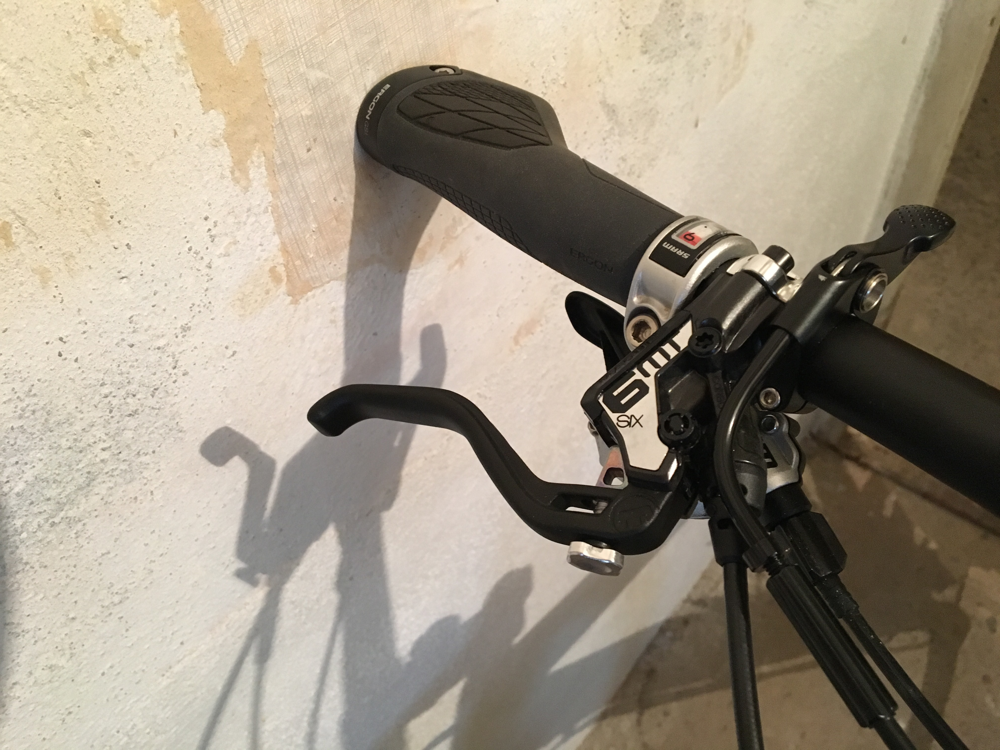
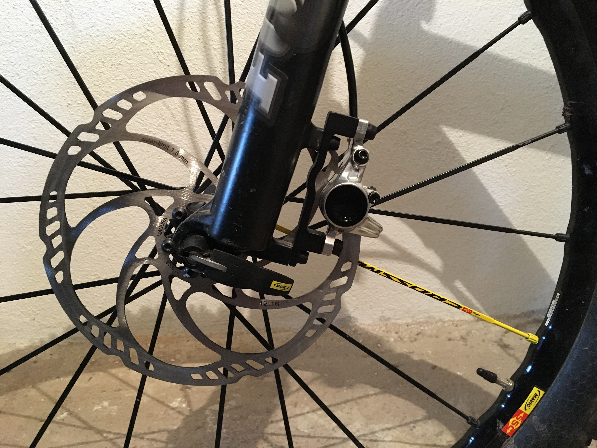

Hin und wieder habe ich das Verlangen etwas handwerkliches zu machen. Manchmal mache ich das auch wirklich. Wie zum Beispiel in den letzten Tagen und Wochen, als ich mir einbildete mein Mountainbike selbst aufzumotzen. Schon länger spiele ich mit dem Plan, mein Bike im Winter einem Schönheitseingriff zu unterziehen. Immerhin habe ich es heuer schon acht Jahre und was soll ich sagen, man sieht ihm das Alter an. Nachdem es aber einen Grund hat, warum ich mein Geld mit Programmieren verdiene und nichts handwerkliches mache, habe ich diesen Plan bis jetzt immer verschoben.

<!--more-->

Heuer aber beschloss ich einmal damit zu beginnen. Zum einen wollte ich unbedingt eine absenkbare Sattelstütze und zum anderen fehlte an den Bremsen schon jeglicher Lack. Glücklicherweise sind absenkbare Sattelstützen gerade der letzte Schrei und fast zeitgleich erschienen im [Mountainbike](http://www.mountainbike-magazin.de/test/parts/8-teleskop-sattelstuetzen-fuer-mountainbikes-im-test.1497166.2.htm)- und im [Bike-Magazin](http://www.bike-magazin.de/komponenten/sattelstuetzen/test-2017-teleksop-sattelstuetzen/a34709.html) Tests für ebendiese. Da mein Bike noch aus einer Zeit kommt, in der niemand wusste dass man absenkbare Sattelstützen einmal brauchen würde, musste eine mit externer Zugverlegung her. In beiden Tests schnitt die [Fox Transfer](https://r2-bike.com/FOX-Sattelstuetze-Transfer-Performance-extern-150-mm) sehr gut ab, weshalb ich mich für dieses Exemplar entschied.

Bei den Bremsen fiel mir die Wahl etwas schwerer. Zwar gab es auch zu den Bremsen Tests in beiden Magazinen und ich überlegte lange ob ich mir den Testsieger die [Magura MT5](https://r2-bike.com/MAGURA-Scheibenbremse-MT5) kaufen sollte, aber eine Vier-Kolben Bremse mit dem Einsatzgebiet All-Mountain/Enduro/Downhill erschien mir dann für mich (<75 Kilo) und mein Einsatzgebiet (Tour/All-Mountain) etwas übertrieben. In den letzten Jahren bremste mich erfolgreich erfolgreich eine Zwei-Kolben Bremse von Avid, also wusste ich nicht was ein Upgrade auf Vier-Kolben rechtfertigen sollte. Schlussendlich entschied ich mich für die [Magura MT6](https://r2-bike.com/MAGURA-Scheibenbremse-MT6-Einzelbremse-2017).

## Der Einbau

Anfang März begann ich dann also mit dem Einbau der Sattelstütze. Bis dahin habe ich Sattelstützen ja regelmäßig entfernt und wieder eingebaut, per Knopfdruck absenken konnte ich sie bis dahin ja nicht. Der Einbau ansich funktioniert ohne Probleme, auch der Seilzug war in wenigen Handgriffen montiert und verlegt. Doch als ich zum ersten Mal den Hebel betätigte passierte nichts. Nach einer kurzen Nachdenkpause schoss mir aber ein warum: ich musste nämlich den Sattel mit der Hand nach unten drücken. No na ned :D

​")

Zwei Wochen später kamen auch die Scheibenbremsen bei mir an und ich verschwand wieder im Keller. Zuvor habe ich mir die [theoretischen Grundlagen](http://www.mountainbike-magazin.de/know-how/werkstatt/so-montieren-sie-ihre-neue-mtb-scheibenbremse.1000492.2.htm#1) bereits näher gebracht, also stand dem Einbau nichts mehr im Weg. Doch schon bei den ersten Handgriffen wurde mir schmerzlich bewusst, was ich schon in der Einleitung anmerkte: Handwerker bin ich keiner. Beim demontieren der alten Bremsscheiben gelang es mir tatsächlich, dass ich zwei Schrauben so ruinierte dass sie mir mein Rad-Mechaniker des Vertrauens schlussendlich nurmehr ausbohren konnte. Das montieren der neuen Scheiben war dann nicht weniger aufregend. Da schaffte ich es dann, den Bit des Drehmomentschlüssels abzureißen als ich die Schrauben festziehen wollte.

Dann begann der wirklich spannende Teil. Zuerst montierte ich die hintere Bremse, in der Hoffnung mir das Kürzen der Bremsleitung zu ersparen. Immerhin war dieses Unterfangen bis zu diesem Zeitpunkt schon aufregend genug. Leider blieb mir das Kürzen nicht erspart. Das Kürzen selbst war eigentlich gar nicht so aufregend, aber leider bekam ich Luft in die Leitung und so musste ich die Bremsen entlüften. Im [Magura Video-Turorial](https://www.youtube.com/watch?v=77xQtK84nDA) wirkte das auch sehr einfach, aber die Menge an Bremsflüssigkeit die ich danach am Boden vorfand erzählte eine andere Geschichte. Mir passierte es nämlich tatsächlich, dass ich durch das Entlüften noch mehr Luft in die Leitung bekam weil ich eine Schraube nicht fest genug anzog.

## Das Finale

Völlig entnervt lies ich danach mein Rad und die Vorderrad-Bremse einige Tage liegen um letzte Woche mit neuem Elan an das vermeintlich letzte Kapitel zu schreiten. Das Montieren der vorderen Bremse und Kürzen der Leitung war dann auch in wenigen Minuten und ohne Zwischenfälle erledigt. Aber die Hinterradbremse wünschte sich eine neuerliche Entlüftung als ich die Bremsbeläge endlich einbremsen wollte. Also packte ich das Entlüftungs-Kit nochmals aus und beim zweiten Versuch klappte das Entlüften schon fast ohne Zwischenfälle. Dann war mein Ausflug in die Welt der Technik endlich zu Ende.

Jetzt steht der ersten Mountainbike-Ausfahrt in diesem Jahr nichts mehr im Weg. Wenn alles gut läuft, meine Bremsen wirken wie sie sollen und ich nicht in irgendeinem Graben ende, werde ich euch an dieser Stelle berichten was ich von diesem Upgrade halte und wie mir die neuen Teile gefallen. Auch wenn dieses Unterfangen von so vielen Pannen begleitet war, muss ich zugeben dass mir das alles ziemlich viel Spaß gemacht hat. In diesem Jahr werde ich zwar keine Schraube mehr an einem meiner Räder freiwillig angreifen, aber für den nächsten Winter schmiede ich schon wieder Pläne.